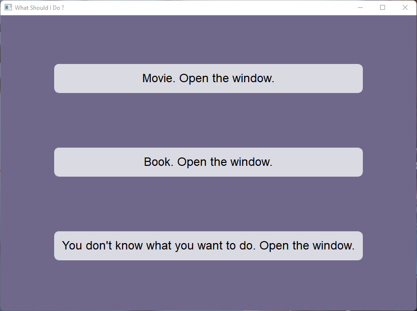
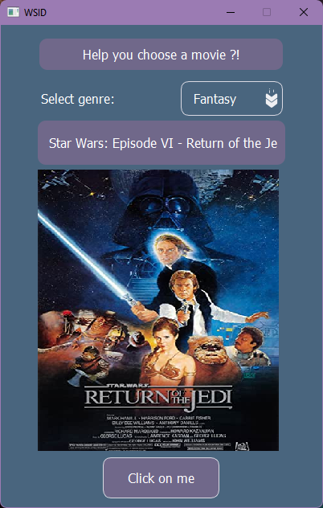
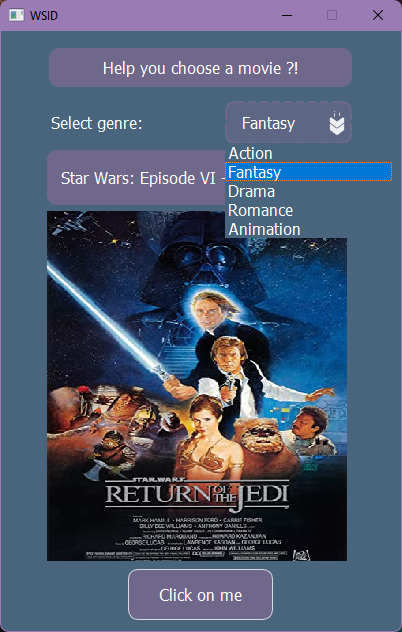

# WSID
#### Video Demo:  https://youtu.be/5qICCFzCuMw
### Description:

*Introduction:*

WSID is a gui application for boring evenings when you do not know what to do. The application will give you the opportunity not to think about what to watch or what to read today. If you want to occupy yourself with something new this is also not a problem the application will tell you what to do in your free time. All we need to  do is to click on two buttons and the program will give the result without any effort.

How does it work?
We have a file which generates the data and after it is formulated and sent to the main application which in turn generates it for the user.
When the user enters the application he sees the main screen which has only 3 buttons



*How it works:*

The "Movie" button allows you to dive into the world of movies and choose something for yourself. By clicking on the genre button you will be able to select one of the five genres presented:

- action
- fantasy 
- drama
- romance
- animation
 
And by clicking "Click on me", the program will give you a random name of the movie and its poster.

The "Book" button will help you choose a book to spend an enjoyable evening with. You can also choose the genre you are interested in from the four represented:

- children's literature
- novel
- poetry
- tragedy

Just as in the window for selecting a movie, when you press the button, the program will give you the author and the title of the book.
 
The last button will help to choose something new for you, maybe it is time to choose a new hobby.





In order to run the program you need to perform a few small steps:
```
git clone 
pip install -r requirements.txt
```
*Let's go through the code:*

#### What technology has been used:

1. PyQT - for GUI
2. python - main technology 
3. pytest - for testing programm
4. API/json - for data exchange

-project.py is the file where the data is formulated. In this file the necessary data from json is converted into a dict and transferred for further work with it. In the same file is a third-party API from which takes the data for the hobby and passed to the file main.py.

-main.py - all other logic inside PYQT takes place in this file. The data from project.py is passed here for further processing and passing to the user when a certain signal is given (pressing a button). When the button is pressed the signal is passed to a class with a specific set of functions to process this signal. A function triggers and then passes the data sent from project.py, depending on the genre the user has chosen a certain condition is triggered.

Files are used to render the application:
-myWIn.py - the main screen with three buttons to open the appropriate windows

-movieUi.py - movie window, here is the interface for movies which appears statically as a result of pressing a button.

-bookUi.py - the window with books just like the window with movies, this window contains only static data

-hobbyUi.py - window for choosing a hobby similar to the previous two windows

-styles.py - this file contains the basic settings for refining the look of the application

*In the future I plan to improve this project, add more options and a better look.*

### I hope you enjoy my project 🙂
